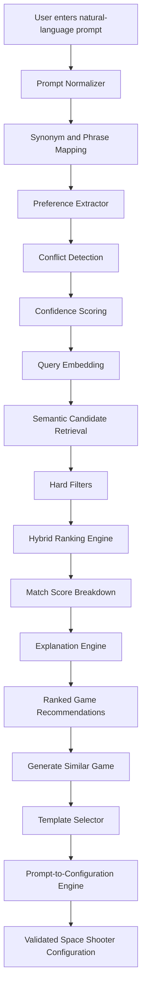
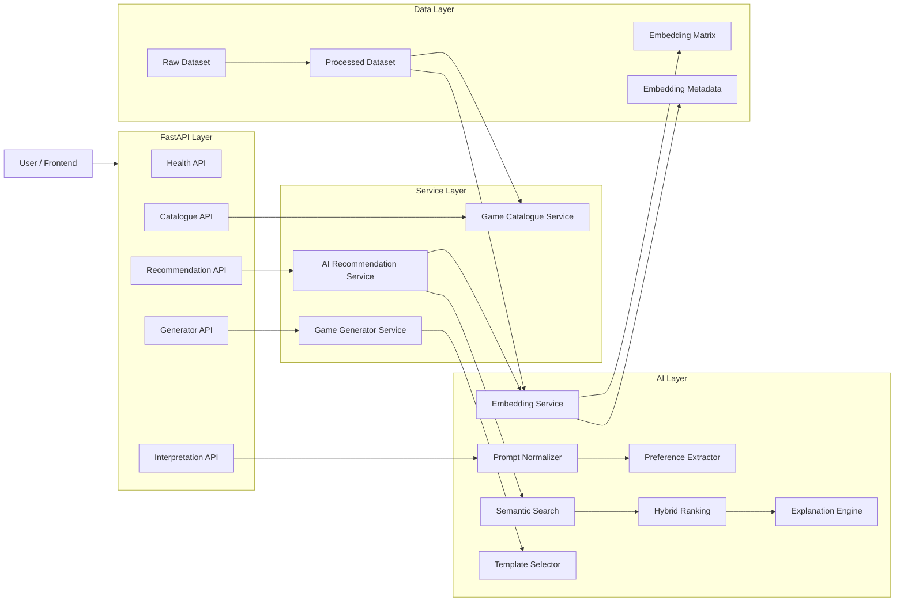
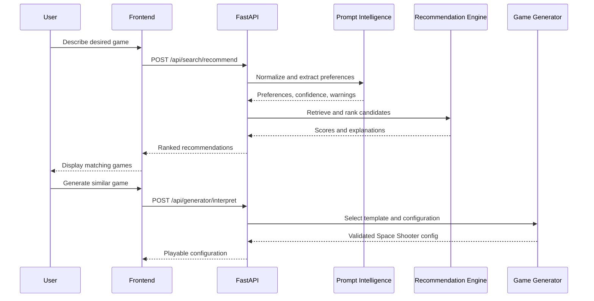

<div align="center">

# 🎮 GameGenie AI

### Describe It. Discover It. Play It.

An AI-powered game discovery and generation platform that understands natural-language preferences, recommends suitable games with explainable match scores, and converts prompts into playable game configurations.

<br>


<br>


</div>

---

## 📌 Overview

**GameGenie AI** is an intelligent game-discovery and game-generation platform.

Instead of manually browsing large game catalogues, users can describe what they want in natural language:

> “A free futuristic multiplayer shooter for a low-end PC.”

GameGenie AI then:

1. Normalizes the prompt.
2. Extracts structured preferences.
3. Detects conflicting requirements.
4. Calculates interpretation confidence.
5. Generates a semantic query embedding.
6. Retrieves relevant game candidates.
7. Applies hybrid ranking.
8. Produces explainable match scores.
9. Returns personalized recommendations.
10. Converts generation prompts into validated game configurations.

The project currently provides the FastAPI backend, game catalogue pipeline, Sprint 2 AI recommendation system, explainability layer, and Space Shooter configuration intelligence.

---

## ✨ Core Features

<table>
<tr>
<td width="50%">

### 🧠 Natural-Language Understanding

- Prompt normalization
- Gaming synonym recognition
- Multi-word phrase detection
- Preference extraction
- Conflict detection
- Confidence scoring
- Matched-term reporting
- Vague-input handling

</td>
<td width="50%">

### 🎯 Intelligent Recommendations

- Semantic embeddings
- Cosine-similarity retrieval
- Hybrid recommendation ranking
- Hard preference filtering
- Match-score breakdown
- Deterministic sorting
- Explainable recommendations
- Configurable result limits

</td>
</tr>

<tr>
<td width="50%">

### 📚 Game Catalogue

- Paginated game listing
- Deterministic text search
- Genre filtering
- Platform filtering
- Rating filtering
- Multiplayer filtering
- Price filtering
- Sorting and facets

</td>
<td width="50%">

### 👾 Game Generation Intelligence

- Space Shooter template selection
- Prompt-to-configuration conversion
- Difficulty interpretation
- Speed configuration
- Enemy-spawn configuration
- Lives configuration
- Difficulty scaling
- Safe value validation and clamping

</td>
</tr>
</table>

---

## 🧩 Supported Preference Categories

GameGenie AI can extract and process preferences including:

| Category | Examples |
|---|---|
| Genres | Shooter, RPG, racing, puzzle, strategy, simulation |
| Platforms | PC, PlayStation, Xbox, Nintendo Switch, Android, iOS |
| Modes | Single-player, multiplayer, cooperative, online, offline |
| Themes | Fantasy, futuristic, cyberpunk, farming, space, medieval |
| Moods | Relaxing, intense, scary, cheerful, atmospheric |
| Visual styles | Pixel art, realistic, cartoon, retro, 2D, 3D |
| Difficulty | Easy, medium, hard |
| Hardware | Low-end, mid-range, high-end |
| Price type | Free, paid |
| Player preferences | Solo, cooperative, team-based |
| Session preferences | Short, medium, long sessions |

The centralized taxonomy includes more than 100 gaming synonyms and phrase mappings.

Examples:

```text
fps              → first-person shooter
rpg              → role-playing
co-op            → cooperative
solo             → single-player
chill            → relaxing
low spec         → low-end
potato pc        → low-end
no cost          → free
play with friends → multiplayer
```

---

## 🔄 Complete AI Workflow



---

## 🏗️ Architecture



---

## 📁 Repository Structure

The actual cloned Git repository is the inner `GameGenie-AI` folder:

```text
GameGenie-Project/
└── GameGenie-AI/
    ├── backend/
    │   ├── app/
    │   │   ├── ai/
    │   │   │   ├── embedding_service.py
    │   │   │   ├── explanation_engine.py
    │   │   │   ├── explanations.py
    │   │   │   ├── game_generator.py
    │   │   │   ├── preference_extractor.py
    │   │   │   ├── preference_parser.py
    │   │   │   ├── prompt_normalizer.py
    │   │   │   ├── ranking_engine.py
    │   │   │   ├── recommendation_engine.py
    │   │   │   ├── recommender.py
    │   │   │   ├── similarity.py
    │   │   │   ├── taxonomy.py
    │   │   │   └── template_selector.py
    │   │   ├── api/
    │   │   │   ├── dependencies.py
    │   │   │   └── routes/
    │   │   │       ├── ai.py
    │   │   │       ├── facets.py
    │   │   │       ├── games.py
    │   │   │       ├── health.py
    │   │   │       └── search.py
    │   │   ├── core/
    │   │   ├── data/
    │   │   ├── schemas/
    │   │   ├── services/
    │   │   └── main.py
    │   ├── data/
    │   │   ├── raw/
    │   │   ├── processed/
    │   │   └── embeddings/
    │   ├── scripts/
    │   │   └── build_embeddings.py
    │   ├── tests/
    │   ├── .env.example
    │   ├── pyproject.toml
    │   ├── requirements.txt
    │   └── requirements-dev.txt
    ├── docs/
    │   ├── ai-architecture.md
    │   ├── api-contract.md
    │   ├── game-generation-ai.md
    │   ├── recommendation-engine.md
    │   ├── recommendation-evaluation.md
    │   └── sprint-2-ai-progress.md
    ├── .gitignore
    └── README.md
```

The exact structure may evolve as frontend, database, and integration phases are merged.

---

# 🚀 Getting Started

## Prerequisites

Install:

- Python 3.11 or newer
- Git
- PowerShell
- A code editor such as VS Code
- Internet access for the initial Sentence Transformer model download

---

## 1. Clone the repository

```powershell
E:
cd "E:\GameGenie-Project"

git clone https://github.com/ItsAnshumanPattanayak/GameGenie-AI.git

cd "E:\GameGenie-Project\GameGenie-AI"
```

Verify the repository:

```powershell
git status
git branch --show-current
git remote -v
```

---

## 2. Create the backend environment

From the repository root:

```powershell
cd backend

python -m venv .venv

.\.venv\Scripts\Activate.ps1

python -m pip install --upgrade pip

python -m pip install -r requirements-dev.txt
```

Python 3.11 or newer is supported.

If PowerShell prevents virtual-environment activation, run:

```powershell
Set-ExecutionPolicy -Scope Process -ExecutionPolicy Bypass
```

Then activate again:

```powershell
.\.venv\Scripts\Activate.ps1
```

---

## 3. Configure environment variables

Create a local environment file:

```powershell
Copy-Item .env.example .env
```

This step is optional because safe development defaults are included.

Important configuration options include:

```env
APP_NAME=GameGenie AI Backend
APP_ENV=development
APP_VERSION=1.0.0
DEBUG=true
API_PREFIX=/api
ALLOWED_ORIGINS=http://localhost:5173
RAW_DATASET_PATH=data/raw/games.json
PROCESSED_DATASET_PATH=data/processed/games.json
LOG_LEVEL=INFO
```

### Security notes

- `.env` is ignored by Git.
- Do not commit credentials or secret values.
- Dataset paths must remain relative to the `backend` folder.
- Path validation prevents configured dataset paths from escaping the backend directory.

---

## 4. Preprocess the game dataset

```powershell
cd backend

.\.venv\Scripts\python.exe -m app.data.preprocessing
```

This will:

- Load the raw game dataset.
- Map alternate field names.
- Validate records.
- Normalize values.
- Remove or merge duplicates.
- Generate deterministic game identifiers.
- Write the processed catalogue atomically.

Processed data is written to:

```text
backend/data/processed/games.json
```

---

## 5. Start the FastAPI backend

```powershell
cd backend

.\.venv\Scripts\python.exe -m uvicorn app.main:app --reload
```

The backend will run at:

```text
http://127.0.0.1:8000
```

API documentation:

| Interface | URL |
|---|---|
| Swagger UI | `http://127.0.0.1:8000/docs` |
| ReDoc | `http://127.0.0.1:8000/redoc` |
| Health endpoint | `http://127.0.0.1:8000/health` |

---

# 🌐 API Endpoints

## Health and catalogue

| Method | Endpoint | Description |
|---|---|---|
| `GET` | `/health` | Service and catalogue status |
| `GET` | `/api/games` | Paginated and filtered game catalogue |
| `GET` | `/api/games/search` | Deterministic text-based game search |
| `GET` | `/api/games/{game_id}` | Retrieve one game |
| `GET` | `/api/genres` | List normalized genres and counts |
| `GET` | `/api/platforms` | List normalized platforms and counts |

## AI and recommendation

| Method | Endpoint | Description |
|---|---|---|
| `POST` | `/api/search/interpret` | Normalize a prompt and extract preferences |
| `POST` | `/api/search/recommend` | Generate ranked and explained recommendations |
| `POST` | `/api/generator/interpret` | Convert a prompt into a game configuration |

---

## Catalogue examples

```text
GET /api/games?genre=RPG&platform=PC
```

```text
GET /api/games?min_rating=4&sort_by=rating&sort_direction=desc
```

```text
GET /api/games?multiplayer=true&page=1&page_size=10
```

```text
GET /api/games/search?q=space&platform=PC
```

---

## Prompt interpretation example

### Request

```http
POST /api/search/interpret
Content-Type: application/json
```

```json
{
  "query": "A free futuristic multiplayer shooter for a low-end PC"
}
```

### Example response structure

```json
{
  "original_prompt": "A free futuristic multiplayer shooter for a low-end PC",
  "normalized_prompt": "a free futuristic multiplayer first-person shooter for a low-end pc",
  "preferences": {
    "genres": [
      "first-person shooter"
    ],
    "platforms": [
      "PC"
    ],
    "modes": [
      "multiplayer"
    ],
    "themes": [
      "futuristic"
    ],
    "moods": [],
    "visual_styles": [],
    "difficulty": null,
    "price_type": "free",
    "hardware_level": "low-end",
    "session_length": null,
    "player_count": null
  },
  "matched_terms": [],
  "warnings": [],
  "confidence": 0.95
}
```

The exact response fields follow the shared API contract.

---

## Recommendation example

### Request

```http
POST /api/search/recommend
Content-Type: application/json
```

```json
{
  "query": "A relaxing science-fiction puzzle game for PC",
  "top_n": 5,
  "filters": {
    "platforms": [
      "PC"
    ],
    "price_type": null
  }
}
```

### Recommendation result includes

- Game information
- Semantic similarity
- Genre score
- Platform score
- Mode score
- Theme score
- Mood score
- Price score
- Difficulty score
- Hardware score
- Final match score
- Human-readable explanation

Example explanation:

> Recommended because it supports PC, matches the puzzle genre, and contains the science-fiction setting requested in your prompt.

Explanations only mention attributes that actually matched.

---

# 🎯 Hybrid Ranking

GameGenie AI combines semantic similarity with structured preference matching.

Initial ranking weights:

| Ranking signal | Weight |
|---|---:|
| Semantic similarity | 50% |
| Genre match | 15% |
| Platform match | 10% |
| Game mode match | 8% |
| Theme and mood match | 7% |
| Price match | 4% |
| Difficulty match | 3% |
| Hardware match | 3% |

## Weight redistribution

A game is not penalized for preference categories that the user did not specify.

Unused category weights are redistributed across active scoring categories.

For example, when the user provides only:

- Genre
- Platform
- Price

the scoring engine redistributes inactive mode, mood, difficulty, and hardware weights rather than assigning zero scores for unspecified requirements.

## Supported hard filters

- Required platform
- Free-only
- Multiplayer-only
- Offline-only

Hard filters are applied before final ranking.

---

# 🧠 Semantic Embeddings

The semantic pipeline uses a lightweight Sentence Transformer model.

For each game, the embedding text combines available fields such as:

```text
Title
Description
Genres
Platforms
Modes
Themes
Moods
Visual style
Difficulty
Hardware level
```

## Build embeddings

After the public model is available locally:

```powershell
cd backend

.\.venv\Scripts\python.exe -m scripts.build_embeddings --batch-size 32
```

Generated artifacts:

```text
backend/data/embeddings/
├── game_embeddings.npy
├── game_ids.json
└── metadata.json
```

`metadata.json` records information such as:

- Model name
- Embedding dimensions
- Game count
- Generation timestamp
- Batch size
- Data fingerprint
- Artifact format version

## Integrity validation

The embedding pipeline verifies:

- Game ID count matches embedding count.
- Embeddings are two-dimensional.
- Dimensions are consistent.
- No `NaN` values exist.
- No infinite values exist.
- Game IDs are unique.
- Metadata matches generated artifacts.

Large external model caches are not committed to the repository.

---

# 👾 Game-Generation Intelligence

GameGenie AI currently supports the:

```text
space_shooter
```

template.

## Generator request

```http
POST /api/generator/interpret
Content-Type: application/json
```

```json
{
  "query": "Create a difficult cyberpunk space shooter with fast enemies and increasing difficulty"
}
```

## Example generated configuration

```json
{
  "template": "space_shooter",
  "title": "Cyber Strike",
  "theme": "cyberpunk",
  "difficulty": "hard",
  "player_speed": 7,
  "enemy_speed": 7,
  "enemy_spawn_interval": 2.0,
  "lives": 2,
  "difficulty_scaling": true
}
```

## Configuration limits

| Setting | Allowed range |
|---|---:|
| Player speed | 3–10 |
| Enemy speed | 1–8 |
| Enemy spawn interval | 0.5–5.0 seconds |
| Lives | 1–5 |

Invalid or excessive values are safely validated or clamped.

Warnings are returned when values require correction.

## Recognized generator phrases

```text
fast player             → higher player speed
very fast enemies       → enemy speed 7
many enemies            → shorter spawn interval
few enemies             → longer spawn interval
easy                    → more lives and slower enemies
hard                    → fewer lives and faster enemies
gets harder             → difficulty scaling enabled
increasing difficulty   → difficulty scaling enabled
cyberpunk               → cyberpunk visual theme
```

The configuration is designed to be consumed directly by the Phaser.js frontend.

---

# 📊 Dataset Pipeline

The development dataset is located at:

```text
backend/data/raw/games.json
```

It is a small, original development dataset containing varied game records and deliberate malformed or duplicate examples for pipeline testing.

Supported input formats:

- JSON array
- JSON object containing a `games` array
- UTF-8 CSV

## Processing stages

```mermaid
flowchart LR
    A[Raw CSV or JSON] --> B[Schema Mapping]
    B --> C[Record Validation]
    C --> D[Text Normalization]
    D --> E[Genre and Platform Normalization]
    E --> F[Boolean, Date, Rating and Price Parsing]
    F --> G[Duplicate Detection]
    G --> H[Stable ID Generation]
    H --> I[Deterministic Sorting]
    I --> J[Atomic Processed Output]
```



## Validation behavior

- Missing titles are skipped.
- Malformed optional values become `null`.
- Known rating scales may be converted to `0–5`.
- Unknown or invalid ratings become `null`.
- Negative prices become `null`.
- Invalid dates remain unknown.
- Invalid years remain unknown.
- Malformed list fields become empty lists.
- Duplicate or skipped records are counted and logged.

At startup:

1. The application loads the processed catalogue.
2. If it is unavailable or invalid, raw data is preprocessed.
3. Catalogue state is loaded once into FastAPI application state.
4. The service can later be replaced by a database-backed implementation.

---

# 🧪 Testing and Quality Checks

From the backend directory:

```powershell
cd backend
```

## Run tests

```powershell
.\.venv\Scripts\python.exe -m pytest
```

## Run Ruff linting

```powershell
.\.venv\Scripts\ruff.exe check .
```

## Verify formatting

```powershell
.\.venv\Scripts\ruff.exe format --check .
```

## Run type checking

```powershell
.\.venv\Scripts\mypy.exe app tests scripts
```

The test suite covers:

- Prompt normalization
- Preference extraction
- Synonym mapping
- Conflict detection
- Confidence scoring
- Taxonomy validation
- Dataset loading
- Dataset preprocessing
- Stable identifier generation
- Duplicate handling
- Catalogue filtering
- Search ranking
- Embedding integrity
- Semantic candidate retrieval
- Hybrid score calculation
- Weight redistribution
- Hard filters
- Explanation correctness
- Template selection
- Prompt-to-configuration generation
- Generator value limits
- AI API integration
- End-to-end discovery flow
- End-to-end configuration generation

Tests use deterministic fixtures where possible so the entire suite does not require repeatedly downloading or loading a production embedding model.

---

# 📖 Documentation

Detailed project documentation is available in:

| Document | Purpose |
|---|---|
| [AI Architecture](docs/ai-architecture.md) | AI modules, taxonomy, and complete workflow |
| [Recommendation Engine](docs/recommendation-engine.md) | Semantic search and hybrid ranking |
| [Game-Generation AI](docs/game-generation-ai.md) | Template selection and configuration generation |
| [API Contract](docs/api-contract.md) | Shared frontend/backend request and response structures |
| [Recommendation Evaluation](docs/recommendation-evaluation.md) | Prompt evaluation results and known weaknesses |
| [Sprint 2 AI Progress](docs/sprint-2-ai-progress.md) | Completed deliverables, blockers, and progress |

---

# ✅ Sprint 2 AI Deliverables

- [x] Finalized game taxonomy
- [x] Added 100+ synonym mappings
- [x] Implemented prompt normalization
- [x] Implemented structured preference extraction
- [x] Added confidence scoring
- [x] Added conflict warnings
- [x] Added prompt-extraction tests
- [x] Added embedding-generation pipeline
- [x] Added embedding artifact validation
- [x] Implemented semantic recommendation service
- [x] Implemented hybrid ranking
- [x] Added match-score breakdown
- [x] Implemented recommendation explanations
- [x] Added recommendation evaluation prompts
- [x] Added Space Shooter template selection
- [x] Implemented prompt-to-game configuration
- [x] Added generator tests
- [x] Added AI architecture documentation
- [x] Added API integration
- [x] Added end-to-end AI workflow tests

---

# 🗺️ Development Roadmap

## Completed

- [x] FastAPI backend foundation
- [x] Game schemas and catalogue services
- [x] Dataset ingestion and preprocessing
- [x] Catalogue search and filtering
- [x] Prompt understanding
- [x] Semantic recommendation foundation
- [x] Hybrid ranking
- [x] Recommendation explanations
- [x] Game-generation intelligence
- [x] Space Shooter configuration generation
- [x] AI tests and documentation

## In progress or upcoming

- [ ] Database-backed recommendation retrieval
- [ ] Search-history persistence
- [ ] Complete React discovery interface
- [ ] Recommendation cards and score visualization
- [ ] Game-details interface
- [ ] Phaser.js Space Shooter integration
- [ ] Recommendation-to-generator frontend handoff
- [ ] Larger production game catalogue
- [ ] Recommendation-quality tuning
- [ ] Additional playable templates
- [ ] Production deployment
- [ ] Authentication and personalized user profiles

---

# 🤝 Team Responsibilities

| Member | Primary responsibility |
|---|---|
| **Anshuman** | AI, recommendation engine, explainability, game-generation intelligence, integration |
| **Thomas** | React frontend, discovery UX, generator interface, Phaser.js Space Shooter |
| **Sarbajit** | Backend APIs, database, validation, history, backend testing and documentation |

---

# 🌿 Git Workflow

Development work should use feature branches.

Example:

```powershell
git switch develop
git pull origin develop

git switch -c feature/your-feature-name
```

After implementation:

```powershell
git add .
git commit -m "feat: describe the implemented feature"
git push -u origin feature/your-feature-name
```

Open a pull request:

```text
feature/your-feature-name → develop
```

Avoid committing directly to `main`.

Do not commit:

- `.env`
- Virtual environments
- Local databases
- Model caches
- API keys
- Access tokens
- Temporary files
- Machine-specific files

---

# 🛡️ Project Principles

- Preserve explainability.
- Never invent matched game attributes.
- Keep score ranges consistent.
- Do not penalize unspecified preferences.
- Avoid hidden paid API calls.
- Keep AI services testable and injectable.
- Preserve deterministic behavior.
- Validate all generated configuration values.
- Keep frontend, backend, and AI contracts synchronized.
- Protect teammate work during integration.
- No feature is complete until it runs on another team member’s system.

---

# 💡 Example User Journey



---

<div align="center">

## 🎮 GameGenie AI

### Describe It. Discover It. Play It.

Built with FastAPI, Python, semantic search, explainable AI, and game-generation intelligence.

<br>

**Working discovery flow • Explainable recommendations • Playable-game intelligence**

</div>
