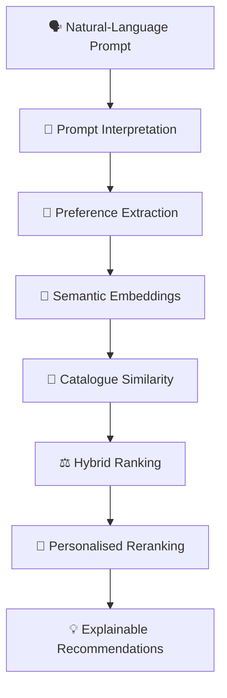
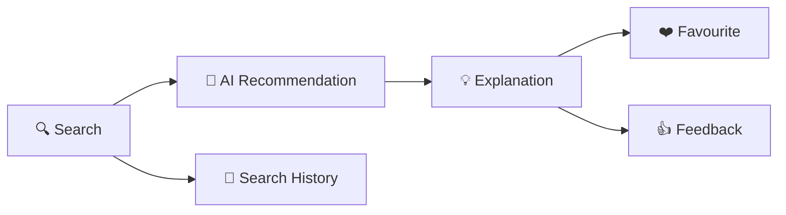
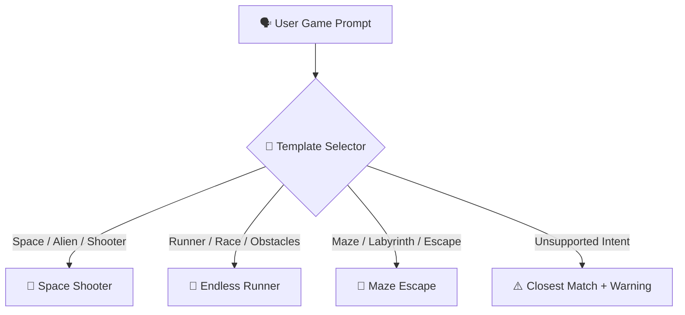
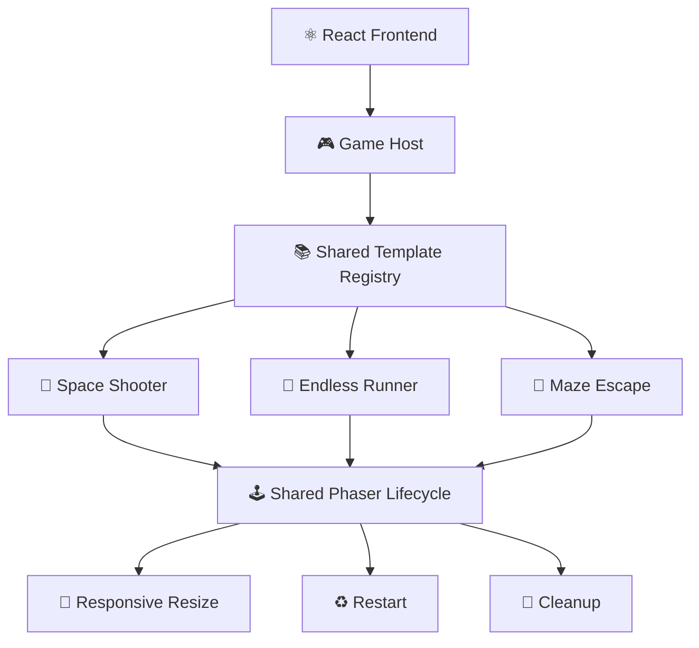
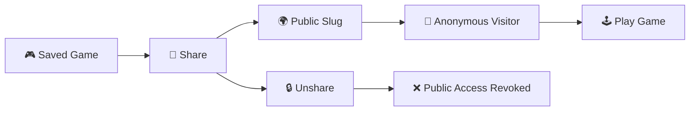
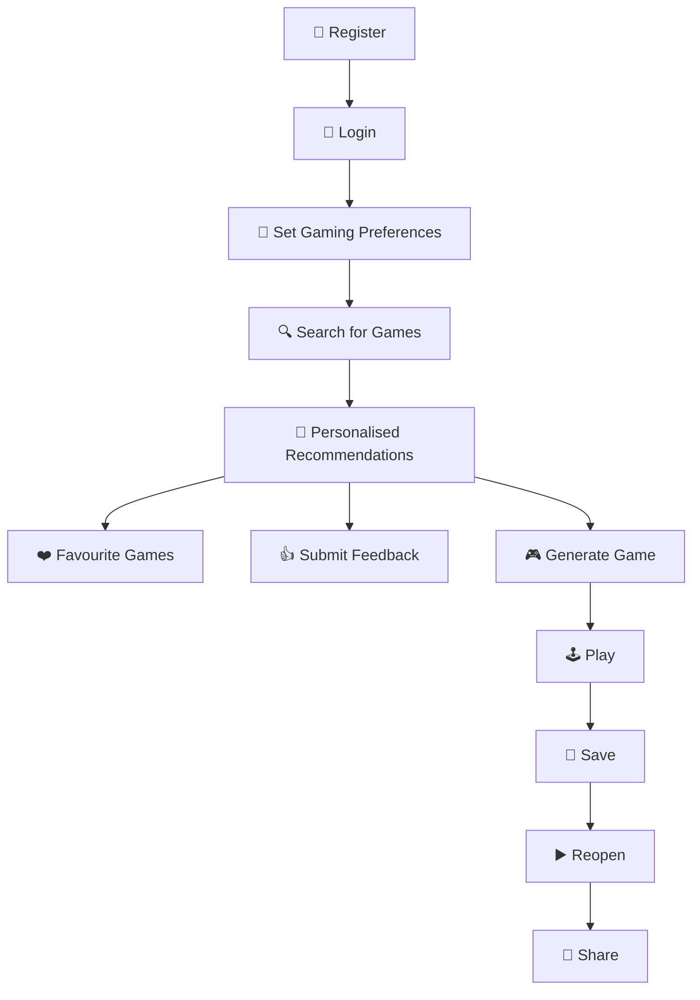
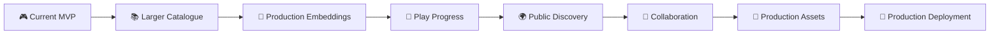

<div align="center">

# 🎮 GameGenie AI

### 🧠 AI-Powered Game Discovery • Personalised Recommendations • Game Generation • Play

**Describe what you want to play. Let AI discover, recommend, generate, save, and share the experience.**

<br>

[](https://github.com/ItsAnshumanPattanayak/GameGenie-AI)


<br>

### 🚀 Sprint 3 Complete • Hackathon MVP Ready

</div>

---

# 🌌 What is GameGenie AI?

**GameGenie AI** is a full-stack AI-assisted gaming platform designed to make game discovery and game generation conversational.

Instead of manually filtering through game catalogues, users can simply describe what they want:

```text
I want a futuristic multiplayer shooter for PC with fast combat.
```

GameGenie interprets the prompt, extracts gaming preferences, performs semantic retrieval, applies hybrid and personalised ranking, and returns explainable recommendations.

It can also transform prompts into **playable Phaser.js mini-games**.

---

# ✨ Key Capabilities

<table>
<tr>
<td width="50%">

### 🔍 AI Game Discovery

- Natural-language search
- Preference extraction
- Semantic similarity
- Hybrid recommendation
- Explainable results
- Search history

</td>
<td width="50%">

### 🧠 Personalisation

- User gaming preferences
- Favourite-game similarity
- Recommendation feedback
- Recent-search influence
- Cold-start handling
- Bounded reranking

</td>
</tr>

<tr>
<td width="50%">

### 🎮 AI Game Generation

- Space Shooter
- Endless Runner
- Maze Escape
- Prompt-to-template selection
- Prompt-to-config generation
- Phaser.js runtime

</td>
<td width="50%">

### 💾 User Platform

- Registration & login
- Protected accounts
- Save generated games
- Reopen & edit games
- Share public games
- Favourites & feedback

</td>
</tr>
</table>

---

# 🧠 AI Recommendation Pipeline



GameGenie considers signals such as:

| Signal | Example |
|---|---|
| 🎭 Genre | Shooter, Strategy, Puzzle |
| 💻 Platform | PC |
| 👥 Mode | Multiplayer, Single Player |
| 🌙 Mood | Competitive, Relaxed |
| 🎚️ Difficulty | Easy, Medium, Hard |
| 💰 Price | Free / Paid preference |
| 🖥️ Hardware | Low-end / Higher-end |
| ❤️ Favourites | Previously saved games |
| 👍 Feedback | Relevant / Interested |
| 🔍 Search History | Recent gaming interests |

---

# 🎯 Personalised Recommendation Engine

Authenticated users receive bounded personalisation on top of the existing Sprint 2 hybrid ranking.

| Ranking Component | Weight |
|---|---:|
| 🧠 Base Hybrid Score | **80%** |
| 🎯 Explicit Preferences | **10%** |
| ❤️ Favourite Similarity | **4%** |
| 👍 Feedback Signal | **4%** |
| 🔍 Recent Searches | **2%** |

### Personalisation Features

- ✅ Anonymous users preserve the original Sprint 2 ranking
- ✅ Cold-start handling
- ✅ Prompt-overlap reduction
- ✅ Double-counting prevention
- ✅ Feedback recency weighting
- ✅ Positive and negative score caps
- ✅ Final score bounds
- ✅ Truthful personalisation explanations

Example:

```text
Recommended because it matches your current shooter request
and your saved preference for multiplayer PC games.
```

---

# 🔍 Natural-Language Game Search

Authenticated users can search directly from the Dashboard.

Example:

```text
A futuristic multiplayer shooter for PC with fast combat
```

The flow becomes:



Searches automatically appear in the user's **History**, and previous queries can be executed again using **Search Again**.

---

# 🎮 AI Game Generation

GameGenie currently supports exactly **three playable templates**.

| Template | Game Type | Description |
|---|---|---|
| 🚀 `space_shooter` | Arcade Shooter | Fast-paced spaceship combat |
| 🏃 `endless_runner` | Runner | Automatic running, jumping and obstacles |
| 🧩 `maze_escape` | Puzzle / Escape | Navigate a timed maze and find the exit |

---

# 🤖 Prompt → Game Template Selection



Example prompts:

```text
Create a futuristic space shooter with aggressive enemies.
```

```text
Create a neon cyberpunk endless runner with high jumps.
```

```text
Create a hard fantasy maze with many obstacles and a short timer.
```

---

# 🏃 Endless Runner Configuration

Example generated configuration:

```json
{
  "template": "endless_runner",
  "title": "Neon Dash",
  "theme": "cyberpunk",
  "difficulty": "medium",
  "player_speed": 6,
  "jump_force": 8,
  "obstacle_frequency": 2.0,
  "difficulty_scaling": true
}
```

Prompt mappings include:

```text
fast runner
→ higher player_speed

high jumps
→ higher jump_force

many obstacles
→ more frequent obstacles

gets faster
→ difficulty_scaling = true
```

---

# 🧩 Maze Escape Configuration

Example:

```json
{
  "template": "maze_escape",
  "title": "Mystic Escape",
  "theme": "fantasy",
  "difficulty": "medium",
  "maze_size": 15,
  "time_limit": 90,
  "obstacle_count": 6
}
```

Prompt mappings include:

```text
large maze
→ larger maze_size

short timer
→ lower time_limit

many obstacles
→ higher obstacle_count

hard maze
→ larger maze + shorter timer + more obstacles
```

---

# 🕹️ Shared Phaser.js Runtime

All three games run through a shared Phaser architecture.



Runtime features:

- ✅ Lazy loading
- ✅ Shared template registry
- ✅ Responsive canvas
- ✅ Game restart
- ✅ Resize support
- ✅ Component cleanup
- ✅ Duplicate Phaser instance prevention
- ✅ Configuration-driven gameplay

---

# 🔐 Authentication & User Profiles

GameGenie provides full account functionality.

### Authentication

```text
Register
Login
Logout
Access Token
Refresh Session
Protected Routes
Session Restoration
```

### User Preferences

```text
Preferred Genres
Preferred Platforms
Preferred Modes
Preferred Moods
Preferred Difficulty
Price Preference
Hardware Level
```

Security includes:

- 🔐 Argon2 password hashing
- 🎫 JWT authentication
- 🔄 Refresh-session rotation
- 🚫 Password hashes never returned
- 🛡️ Protected user data
- 🔑 Environment-based secrets
- 👤 Ownership enforcement

---

# ❤️ User Activity

## 📜 Search History

Users can:

- View previous searches
- Search again
- Delete one search
- Delete complete history

---

## ❤️ Favourites

Users can:

- Favourite catalogue games
- Remove favourites
- View saved favourites
- Use favourites as a personalisation signal

---

## 👍 Recommendation Feedback

Available feedback:

```text
Relevant
Not Relevant
Interested
Already Played
```

Feedback contributes to future personalised ranking.

---

# 💾 Generated Game Library

Generated games can be:

```text
Generate
   ↓
Play
   ↓
Save
   ↓
Reopen
   ↓
Edit
   ↓
Share
```

Users can:

- 💾 Save generated games
- ▶️ Reopen games
- ✏️ Update configurations
- 🗑️ Delete games
- 🔗 Share games
- 🔒 Unshare games

---

# 🔗 Public Game Sharing

Saved games can be made public through unique share links.



Public responses do not expose private account information.

---

# 🧬 Generated Game Version Compatibility

Current supported configuration versions:

```text
1.0
1.1
```

GameGenie supports:

- Legacy configuration loading
- Safe default restoration
- Core gameplay-value preservation
- Migration indication
- Invalid version rejection
- Unsupported version rejection
- Wrong-template configuration rejection

---

# 🧭 Main Frontend Routes

| Route | Purpose |
|---|---|
| `/register` | Create account |
| `/login` | User login |
| `/dashboard` | Main personalised dashboard |
| `/profile` | Account profile |
| `/preferences` | Gaming preferences |
| `/history` | Search history |
| `/favourites` | Favourite games |
| `/generator` | AI game generator |
| `/my-games` | Saved generated games |
| `/play/saved/:id` | Reopen saved game |
| `/shared/:slug` | Public shared game |

---

# 🏗️ Project Architecture

```text
GameGenie-AI
│
├── 🐍 backend
│   │
│   ├── app
│   │   ├── ai
│   │   │   ├── embedding_service.py
│   │   │   ├── recommendation_engine.py
│   │   │   ├── ranking_engine.py
│   │   │   ├── personalisation.py
│   │   │   ├── template_selector.py
│   │   │   └── game_generator.py
│   │   │
│   │   ├── api
│   │   ├── core
│   │   ├── data
│   │   ├── models
│   │   ├── schemas
│   │   └── services
│   │
│   ├── alembic
│   ├── data
│   ├── tests
│   ├── requirements.txt
│   └── requirements-dev.txt
│
├── ⚛️ frontend
│   │
│   ├── src
│   │   ├── components
│   │   ├── games
│   │   ├── pages
│   │   ├── test
│   │   ├── api.ts
│   │   └── styles.css
│   │
│   ├── package.json
│   ├── pnpm-lock.yaml
│   └── vite.config.ts
│
├── 📚 docs
│
└── README.md
```

---

# 🧰 Technology Stack

<table>
<tr>
<td valign="top" width="33%">

## 🐍 Backend

- Python 3.11+
- FastAPI
- SQLAlchemy
- Alembic
- Pydantic
- PyJWT
- Argon2
- SQLite

</td>

<td valign="top" width="33%">

## ⚛️ Frontend

- React 18
- TypeScript
- Vite
- Phaser.js
- pnpm
- Responsive CSS

</td>

<td valign="top" width="33%">

## 🧠 AI / ML

- Sentence Transformers
- Semantic Embeddings
- Cosine Similarity
- NumPy
- scikit-learn
- Hybrid Ranking
- Rule-Based Personalisation

</td>
</tr>
</table>

---

# ⚙️ Local Development Setup

## 📌 Prerequisites

Install:

```text
Git
Python 3.11+
Node.js
VS Code
```

Install `pnpm`:

```powershell
npm install -g pnpm
```

Verify:

```powershell
git --version
python --version
node --version
npm --version
pnpm --version
```

---

# 1️⃣ Clone the Repository

```powershell
git clone https://github.com/ItsAnshumanPattanayak/GameGenie-AI.git
```

```powershell
cd GameGenie-AI
```

Open in VS Code:

```powershell
code .
```

If `code .` is unavailable:

```text
VS Code
→ File
→ Open Folder
→ GameGenie-AI
```

---

# 2️⃣ Backend Setup

Open **Terminal 1**.

```powershell
cd backend
```

Create virtual environment:

```powershell
python -m venv .venv
```

If PowerShell blocks script activation:

```powershell
Set-ExecutionPolicy -ExecutionPolicy RemoteSigned -Scope CurrentUser
```

Activate:

```powershell
.\.venv\Scripts\Activate.ps1
```

Install backend dependencies:

```powershell
python -m pip install -r requirements-dev.txt
```

---

## 🔐 Backend Environment

Create your local environment file:

```powershell
Copy-Item .env.example .env
```

Generate a secure authentication secret:

```powershell
$bytes = New-Object byte[] 64
[Security.Cryptography.RandomNumberGenerator]::Create().GetBytes($bytes)
[Convert]::ToBase64String($bytes)
```

Place the generated value inside:

```text
backend/.env
```

Example:

```env
AUTH_SECRET_KEY=YOUR_RANDOM_SECRET_HERE
ALLOWED_ORIGINS=http://localhost:5173,http://127.0.0.1:5173
```

> [!WARNING]
> Never commit `backend/.env`.
> It contains your private authentication secret.

---

## 🗄️ Database Setup

Apply all migrations:

```powershell
alembic upgrade head
```

Check current migration:

```powershell
alembic current
```

---

## 🚀 Start Backend

```powershell
python -m uvicorn app.main:app --reload
```

Backend:

```text
http://127.0.0.1:8000
```

Swagger API:

```text
http://127.0.0.1:8000/docs
```

Keep Terminal 1 running.

---

# 3️⃣ Frontend Setup

Open **Terminal 2**.

```powershell
cd frontend
```

Create local frontend environment:

```powershell
Copy-Item .env.example .env
```

It should contain:

```env
VITE_API_URL=http://127.0.0.1:8000
```

Install dependencies:

```powershell
pnpm install
```

Start the frontend:

```powershell
pnpm dev
```

Vite should display:

```text
http://localhost:5173/
```

Open this URL in your browser.

---

# ▶️ Running the Complete Application

You need **two terminals running together**.

### 🐍 Terminal 1 — Backend

```powershell
cd backend
.\.venv\Scripts\Activate.ps1
python -m uvicorn app.main:app --reload
```

### ⚛️ Terminal 2 — Frontend

```powershell
cd frontend
pnpm dev
```

Then open:

```text
http://localhost:5173/
```

---

# 👤 Recommended First-Time User Flow



---

# 🧪 Testing & Verification

## 🐍 Backend

```powershell
cd backend
pytest
```

Latest verified baseline:

```text
✅ 283 backend tests passing
```

Quality checks:

```text
✅ Pytest
✅ Ruff lint
✅ Ruff format
✅ MyPy
✅ OpenAPI generation
✅ Alembic migrations
```

---

## ⚛️ Frontend

```powershell
cd frontend
pnpm test
```

Latest verified baseline:

```text
✅ 42 frontend tests passing
```

Additional verification:

```text
✅ TypeScript
✅ Production Vite build
✅ Responsive layout
✅ Browser smoke tests
```

---

# 🛡️ Security

Implemented protections include:

| Security Feature | Status |
|---|---|
| Argon2 Password Hashing | ✅ |
| JWT Access Tokens | ✅ |
| Refresh Session Rotation | ✅ |
| Protected Routes | ✅ |
| User Data Ownership | ✅ |
| Cross-User Access Protection | ✅ |
| Secret Environment Variables | ✅ |
| CORS Origin Restrictions | ✅ |
| Public / Private Game Separation | ✅ |
| Password Hash Exclusion | ✅ |

---

# 📚 Documentation

Full technical documentation is available inside:

```text
docs/
```

Important documents:

```text
authentication.md
user-preferences.md
user-activity.md
personalised-recommendation-engine.md
personalisation-evaluation.md
ai-workflow.md
game-generation-ai.md
multi-template-generation.md
generated-games.md
api-contract.md
sprint-3-completion-report.md
```

---

# ✅ Development Status

| Phase | Feature | Status |
|---|---|---|
| Phase 1 | Backend Foundation | ✅ Complete |
| Phase 2 | Dataset & Preprocessing | ✅ Complete |
| Phase 3 | Prompt Interpretation | ✅ Complete |
| Phase 4 | Semantic Recommendation | ✅ Complete |
| Phase 5 | Hybrid Ranking & Explainability | ✅ Complete |
| Phase 10 | Authentication & Profiles | ✅ Complete |
| Phase 11 | History, Favourites & Feedback | ✅ Complete |
| Phase 12 | Personalised Recommendations | ✅ Complete |
| Phase 8 | Multi-Template Phaser Games | ✅ Complete |
| Phase 13 | Save / Reopen / Share Games | ✅ Complete |
| Phase 15 | Testing & Integration | ✅ Complete |

---

<div align="center">

## 🟢 CURRENT PROJECT STATUS

### ✅ SPRINT 3 COMPLETE

### 🚀 HACKATHON MVP READY FOR FINAL DEMO

</div>

---

# ⚠️ Current Limitations

- Game play-progress and scores are not persisted.
- Public links currently behave as bearer-style URLs.
- Refresh tokens use browser local storage.
- Phaser games currently use lightweight programmatic graphics.
- Production-quality art and audio are not yet included.
- Recommendation evaluation currently uses a small development catalogue.
- Production embedding generation and large-scale evaluation remain future work.

---

# 🛣️ Future Roadmap



Planned post-MVP improvements:

- Larger real-world game catalogue
- Production embedding pipeline
- Improved recommendation evaluation
- Play-progress persistence
- Continue Playing
- Public game discovery
- Collaborative generated games
- Production game art and audio
- Cookie-based refresh sessions
- Cross-browser gameplay CI
- More generated game templates
- Cloud deployment

---

# 👨‍💻 Contributors

<table>
<tr>
<td align="center" width="33%">

### 👨‍💻 Anshuman Pattanayak

**AI • Full-Stack • Integration**

AI recommendation engine  
Personalisation system  
Game-generation intelligence  
Authentication integration  
Backend/frontend integration  
Phaser integration  
Testing & MVP integration

</td>

<td align="center" width="33%">

### 🎨 Thomas

**Frontend • Phaser.js**

Contributed during earlier frontend development and project planning.

</td>

<td align="center" width="33%">

### 🗄️ Sarbajit

**Backend • Database**

Contributed during earlier backend development and project planning.

</td>
</tr>
</table>

---

# 🎯 Project Mission

> **GameGenie AI aims to make game discovery and game generation conversational — enabling users to describe what they want to play, receive explainable personalised recommendations, and instantly generate playable game experiences.**

---

<div align="center">

# 🎮 GameGenie AI

### Discover • Recommend • Generate • Play

<br>

**Built with AI 🧠 • FastAPI ⚡ • React ⚛️ • Phaser.js 🎮**

<br>

⭐ **If you like the project, consider giving the repository a star!** ⭐

[](https://github.com/ItsAnshumanPattanayak/GameGenie-AI)

</div>
